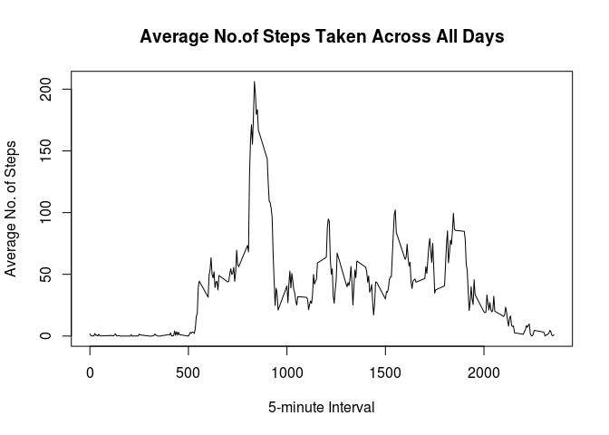
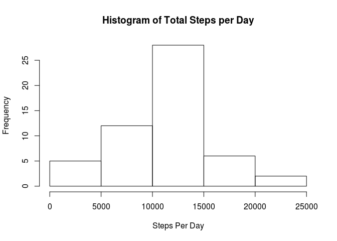
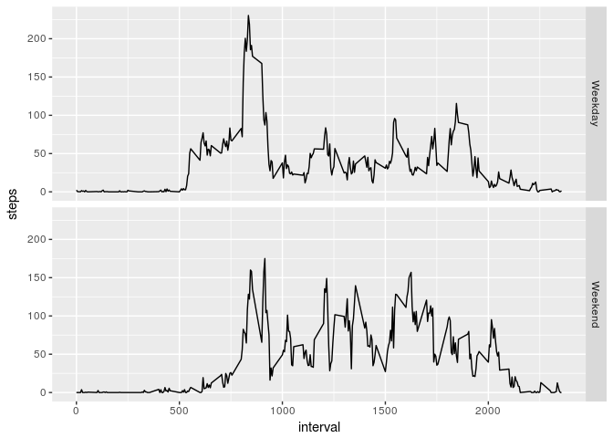

## Dataset

Dataset: Activity monitoring data [52K] https://d396qusza40orc.cloudfront.net/repdata%2Fdata%2Factivity.zip

## Read the data:


```r
	url<-"https://d396qusza40orc.cloudfront.net/repdata%2Fdata%2Factivity.zip"
	zip_file <- file.path(getwd(), "repdata%2Fdata%2Factivity.zip")
	
	f<-"./activity.csv"
	uci_zipfile<-".repdata%2Fdata%2Factivity"
	
	
		download.file(url, zip_file, mode = "wb")
		unzip("repdata%2Fdata%2Factivity.zip", overwrite=TRUE)

	file<-"./activity.csv"
	activityNA<-read.csv(file,header=TRUE, sep=",",stringsAsFactors=FALSE)
```


## Removing NA values 


```r
	activity<-activityNA[with(activityNA,{!(is.na(steps))}),]
```


## Get the total number of steps for each day


```r
activity$date<-as.Date(activity$date,format="%Y-%m-%d")
	
	library(dplyr)
```

```
## 
## Attaching package: 'dplyr'
```

```
## The following objects are masked from 'package:stats':
## 
##     filter, lag
```

```
## The following objects are masked from 'package:base':
## 
##     intersect, setdiff, setequal, union
```

```r
	#group by date
	groupedData<-group_by(activity,date)
	
	#get the total steps in a day
	s<-summarize(groupedData,steps=sum(steps))
	

	hist(s$steps,main="Histogram of Total Steps per Day",xlab="Steps Per Day")
```

<!-- -->

# Mean and median number of steps taken


```r
mean(s$steps)
```

```
## [1] 10766.19
```

```r
median(s$steps)
```

```
## [1] 10765
```

# Time series plot of the average number of steps taken
Make a time series plot (i.e. \color{red}{\verb|type = "l"|}type="l") of the 5-minute interval (x-axis) and the average number of steps taken, averaged across all days (y-axis)


```r
time_series<-select (activity,interval,steps)

## group by interval #
g<-group_by(time_series,interval)

avg_step<-summarize(g,steps=mean(steps))
plot(x=avg_step$interval,y=avg_step$steps,type="l",main="Average No.of Steps Taken Across All Days",xlab="5-minute Interval",ylab="Average No. of Steps")
```

<!-- -->

Which 5-minute interval, on average across all the days in the dataset, contains the maximum number of steps?


```r
avg_step[which.max(avg_step$steps),]
```

```
## # A tibble: 1 x 2
##   interval steps
##      <int> <dbl>
## 1      835   206
```

## Imputing missing values
Note that there are a number of days/intervals where there are missing values (coded as \color{red}{\verb|NA|}NA). The presence of missing days may introduce bias into some calculations or summaries of the data.

Calculate and report the total number of missing values in the dataset (i.e. the total number of rows with \color{red}{\verb|NA|}NAs)


```r
nrow(filter(activityNA,is.na(steps)==TRUE))
```

```
## [1] 2304
```

Devise a strategy for filling in all of the missing values in the dataset. The strategy does not need to be sophisticated. For example, you could use the mean/median for that day, or the mean for that 5-minute interval, etc.


```r
# get mean steps for each interval
groupedData<-group_by(activity,interval)
mean_steps<-summarize(groupedData, steps=mean(steps))

activityOnlyNA<-activityNA[with(activityNA,{(is.na(steps))}),]
activityOnlyNA<-select(activityOnlyNA,interval,date)
imputedData<-merge(activityOnlyNA,mean_steps,by.x="interval", by.y="interval")
```

Create a new dataset that is equal to the original dataset but with the missing data filled in.

```r
imputedData<-data.frame(select(imputedData, steps,date,interval),stringsAsFactors = FALSE)
activity<-data.frame(select(activity,steps,date,interval),stringsAsFactors = FALSE)
imputedData$date<-as.Date(imputedData$date,format="%Y-%m-%d")
activityImputed<-rbind(imputedData,activity)
```

Make a histogram of the total number of steps taken each day and Calculate and report the mean and median total number of steps taken per day. Do these values differ from the estimates from the first part of the assignment? What is the impact of imputing missing data on the estimates of the total daily number of steps?


```r
activityImputed$date<-as.Date(activityImputed$date,format="%Y-%m-%d")
	
	library(dplyr)
	
	#group by date
	groupedImputedData<-group_by(activity,date)
	
	#get the total steps in a day
	s<-summarize(groupedImputedData,steps=sum(steps))
	

	hist(s$steps,main="Histogram of Total Steps per Day",xlab="Steps Per Day")
```

<!-- -->

Are there differences in activity patterns between weekdays and weekends?
For this part the \color{red}{\verb|weekdays()|}weekdays() function may be of some help here. Use the dataset with the filled-in missing values for this part.

Create a new factor variable in the dataset with two levels – “weekday” and “weekend” indicating whether a given date is a weekday or weekend day.


```r
weekend<-factor(c("Weekday","Weekend"))
```

Make a panel plot containing a time series plot (i.e. \color{red}{\verb|type = "l"|}type="l") of the 5-minute interval (x-axis) and the average number of steps taken, averaged across all weekday days or weekend days (y-axis). See the README file in the GitHub repository to see an example of what this plot should look like using simulated data.


```r
## filter only the weekend activities and a column for Day
a<- filter(activity,weekdays(as.Date(date)) %in% c("Saturday","Sunday") )

a<-mutate(a,Dayofweek ="Weekend") 
 
# filter only the weekdays and add a column for Day
b<- filter(activityImputed,!(weekdays(as.Date(date)) %in% c("Saturday","Sunday") ))
b<-mutate(b,Dayofweek ="Weekday") 
activityWithDays<-rbind(a,b)

# get average number of steps on each interval
g<-group_by(activityWithDays,interval,Dayofweek)
summarizedDayActivity<-summarize(g,steps=mean(steps))

library(ggplot2)

ggplot(summarizedDayActivity, aes(x=interval, y=steps)) + 
  facet_grid( Dayofweek~.) +
  geom_line()
```

<!-- -->


